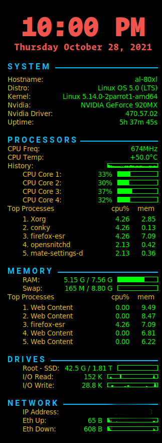

# rng70-conky
This script is my conky setup script in Mate in Parrot OS.

It was forked from [here](https://github.com/ChrisTitusTech/titus-conky). After setting up it will look like 

<table>
    <tr>
        <td align="center">
            
        </td>
    </tr>
</table>  

Font used for showing time is `Operator Mono` and for texts is `Roboto`.
